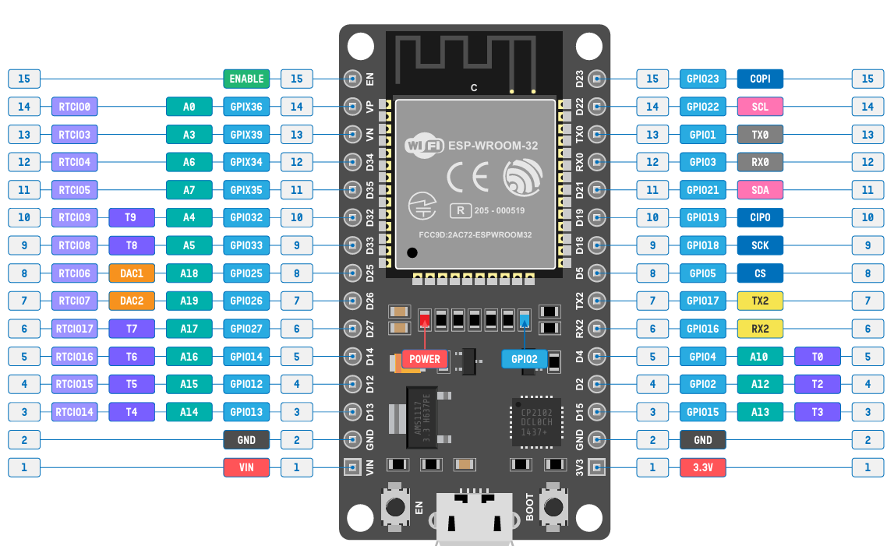
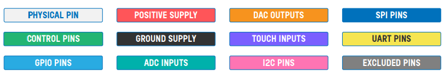
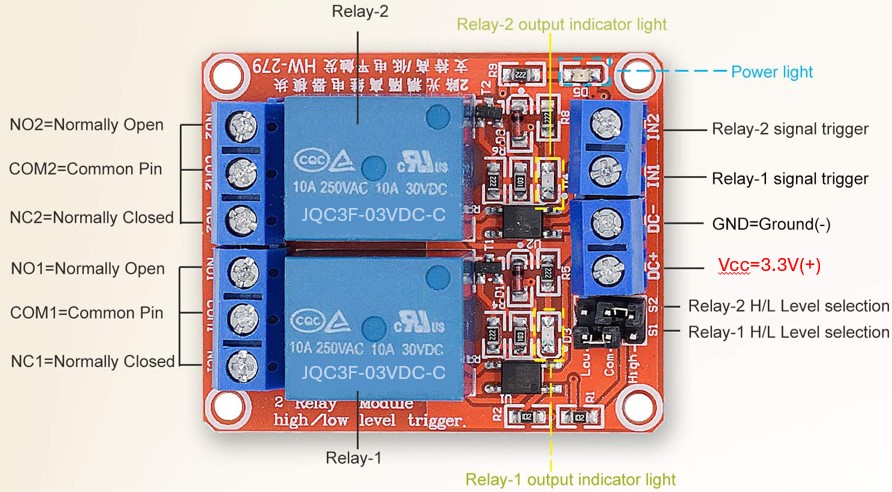
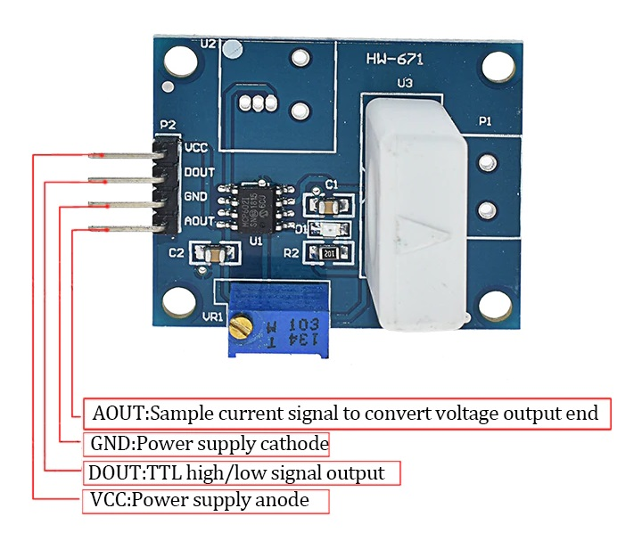
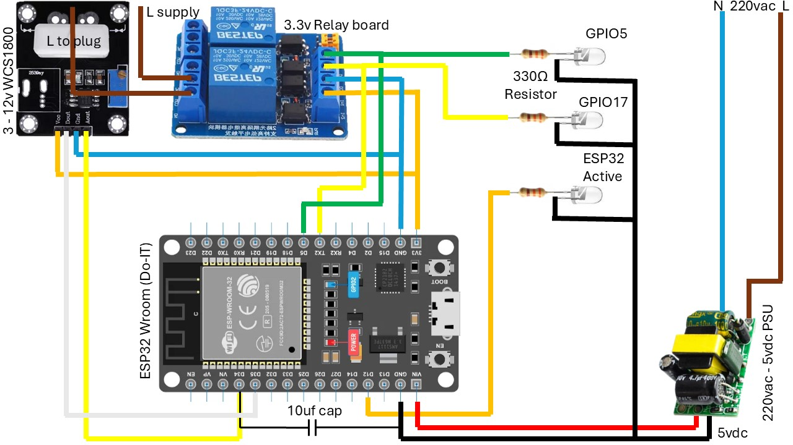

# CS50x Ground Control with ESP32

Build a micropython app that runs on an ESP-32, allowing scheduled control of a pump & sprinkler system. The ESP32 includes a web application with system information & adjustable schedule parameters for watering intervals.   
This project aims to:  
- Save water by disabling the sprinklers when ground moisture is sufficient.  
- Power a 0.35-2kW borehole pump that supplies water to a sprinkler system.  
- Measure pump amperage to protect the pump.  

## Single part diagrams 
[DOIT ESP32-WROOM DEVKIT V1](https://www.circuitstate.com/pinouts/doit-esp32-devkit-v1-wifi-development-board-pinout-diagram-and-reference/#PNG)


- **GPIO pins 34, 35, 36 and 39 are input only.**
- **TX0 and RX0 (Serial0) are used for serial programming.**
- **TX2 and RX2 can be accessed as Serial2.**
- **Default SPI is VSPI. Both VSPI and HSPI pins can be set to any GPIO pins.**
- **All GPIO pins support PWM and interrupts.**
- **Builtin LED is connected to GPIO2.**
- **Some GPIO pins are used for interfacing flash memory and thus are not shown.**

[3,3V 2 Channel High/Low Level Triger Relay Module with Optocoupler](https://www.communica.co.za/products/bdd-relay-board-2ch-3-3v?utm_source=www.communica.co.za&variant=47620050616620&sfdr_ptcid=31591_617_701056022&sfdr_hash=99be365224499160d9bb1f33df9e1613&gad_source=1&gclid=Cj0KCQiA4L67BhDUARIsADWrl7ESoeNl58OGLH5leLPfqXxXJ2_CKvnr-xlaqCA4ljWwufKBiJU78XAaAkmbEALw_wcB)


[WCS1800 Hall 25A Current Sensor](https://www.robotics.org.za/HW-671?search=wcs1800)


## Project Diagram 
  

## Parts & Functions  

- **ESP-Wroom-32 (Do-IT version)**: Main controller for pump monitoring and control.  
- **Relay board 3.3V**: Controls 220VAC outputs up to 10A.  
- **WCS1800 Current board 3-12V**: Measures current from 0 - 25A AC.  
- **5V DC Power Supply (PSU)**: Supplies 5V to the ESP32.  
- **Breadboard Jumpers assorted**: For connections.  
- **USB programming cable**: For programming the ESP32.  
- **AC220 Power socket with 16A plug and lead**: For power supply.  
 

# Project file walk through:

## boot.py the code that runs 1st. Can be used to initialise once off functions

```py
import machine
import network
import time
```
- **Imports:** The script begins by importing essential modules:

- **machine:** Provides access to hardware-related functions.

- **network:** Used for managing network interfaces and connectivity.

- **time:** Includes time-related functions, such as delays.

```py
# Add a delay to prevent bootlooping
time.sleep(10)  # 10-second delay for reloading
print("Starting main program...")

```
- **Initial Delay:** Adds a delay at the start to prevent bootlooping & gives time for the system to stabilize before proceeding. This 10 second delay seems excesive, but because of the way the main.py program runs using websockets (that stay open), this 10s gives you enough time to quickly in PyMakr `Stop script` and then `Sync project to device`. Without this, the ESP32 is sometimes too busy and stalls PyMakr processes.

**Network Initialization:**
```py
# List of known networks and their passwords
KNOWN_NETWORKS = {
    'Router ssid1': 'Router password',
    'Router ssid2': 'Router password',
    'Router ssid3': 'Router password',
    'Router ssid4': 'Router password'
    }

def do_connect():  
    # Create instances for connection objects  
    station = network.WLAN(network.STA_IF)  # For ESP station to connect to a router   
    access_point = network.WLAN(network.AP_IF)  # For others to connect to the ESP Access Point  
    access_point.active(False)  # Deactivate access point interface

```
- **KNOWN_NETWORKS:** Supply all the local router details, from which your device can choose to connect.
- **station = network.WLAN(network.STA_IF):** Creates an instance for connecting to a router.
- **access_point = network.WLAN(network.AP_IF):** Creates an instance for the ESP32 to act as an access point.
- **access_point.active(False):** Deactivates the access point interface to prevent others from connecting to the ESP32.


**Network Connection:**
```py
    if not station.isconnected():  
        print('connecting to network...')  
        station.active(True)  
        station.connect('TP-LINK_Garage', '32HRGUM7K9FFGXLK')  
        
        # Assign static IP address
        # This line can be left out if you prefer to use DHCP 
        station.ifconfig(('10.0.0.111', '255.255.255.0', '10.0.0.254', '10.0.0.254'))  # (IP, Subnet mask, Gateway, DNS)
        
        while not station.isconnected():  
            pass  
    print('network config:', station.ifconfig(), 'SSID:', station.config('essid')) 

    do_connect()
```

**Checks if the station interface is connected.**

**If not connected:**

- Activates the station interface.

- Connects to the specified Wi-Fi network ('TP-LINK_Garage') with the provided password.

- Assigns a static IP address (optional step). Can be skipped if using DHCP.

- Waits until the connection is established.

- Prints the network configuration and SSID once connected.

**`do_connect()`** Calls the do_connect function to establish the network connection as described above.


**GPIO Initialization Setup:**
```py
print("Initialize GPIO pins for ESP32_WROOM")
pins_to_initialize = {
    2: 0,  # Turn off
    4: 0,  # Turn off
    5: 0,  # Turn off
    17: 1  # Turn on for test sequence
}
```
- Prints a message indicating the start of GPIO pin initialization.

- pins_to_initialize dictionary specifies the initial states for the GPIO pins:

- 2, 4, 5: Set to 0 (OFF).

- 17: Set to 1 (ON) for testing purposes.

```py
for pin_number, state in pins_to_initialize.items():
    pin = machine.Pin(pin_number, machine.Pin.OUT)
    pin.value(state)
print("GPIO pins initialized")
```
- Iterates over the pins_to_initialize dictionary.

- For each pin, sets the specified state (0 for OFF, 1 for ON).

- Prints a message indicating the completion of GPIO pin initialization.

## main.py the code that runs 2nd, and continuously. Here the real work starts.


# Project Help and Resources 

For taking notes, retention and understanding of information: 
[Notion](https://www.notion.com/)
[Sider Chatgpt Sidebar for Chrome](https://chromewebstore.google.com/detail/sider-chatgpt-sidebar-+-g/difoiogjjojoaoomphldepapgpbgkhkb)

For help getting started with different sensors and periferals even though i am using vscode:
[RandomNerdTutorials - MicroPython](https://randomnerdtutorials.com/projects-esp32-esp8266-micropython/)
